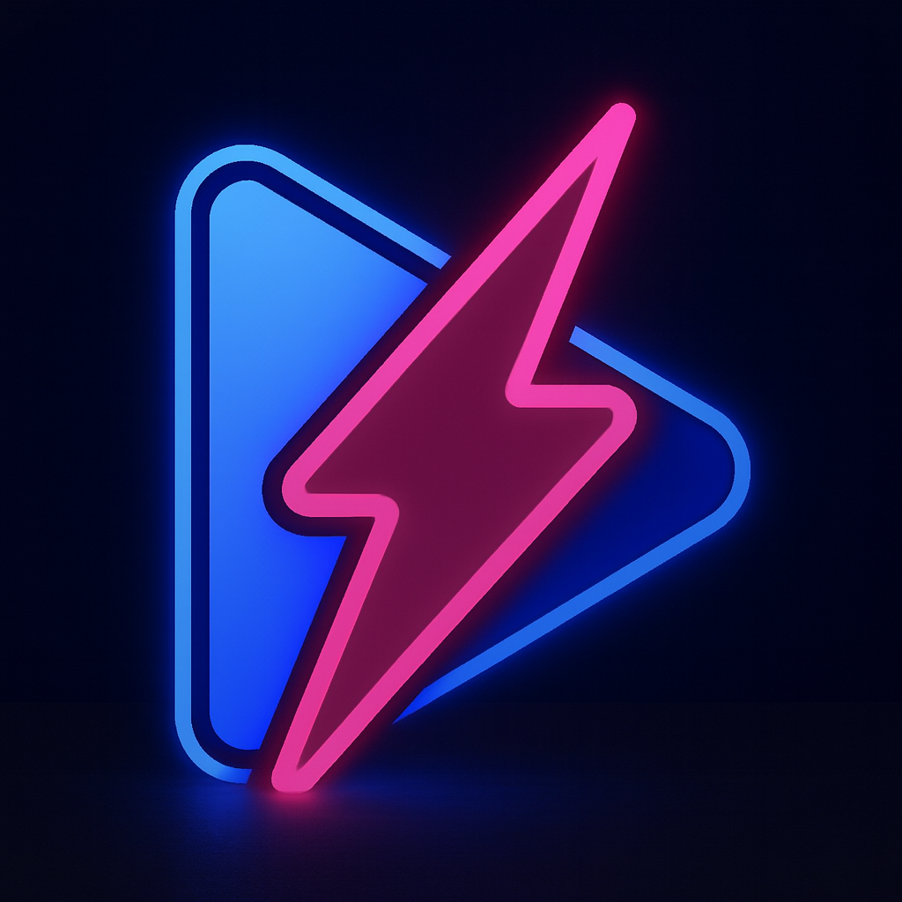
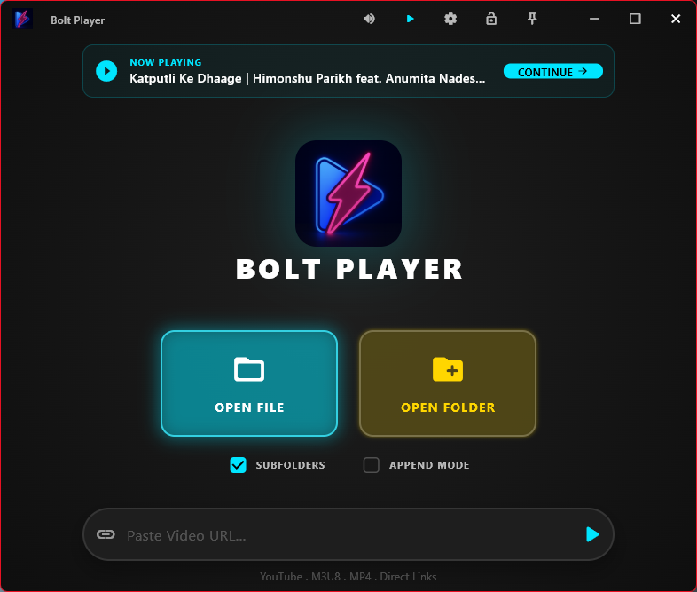

# Bolt Player ⚡

Bolt Player is a high-performance, aesthetically stunning media player built with Flutter, designed for power users, gamers, and enthusiasts. Featuring a sleek neon-cyan "Gamer Theme," it blends cutting-edge visuals with extreme functionality, serving as a modern, lightweight, and powerful alternative to standard players.

  

---

## 🚀 Get the Latest Release
Head over to the **[Releases](https://github.com/Yuvi-GD/bolt_player/releases)** page to download the latest version.

- **Installer** ([BoltPlayer_Setup_x.x.x.exe](https://github.com/Yuvi-GD/bolt_player/releases/download/v1.0.0/BoltPlayer_Setup_1.0.0.exe)) — Recommended. Registers file associations so you can right-click any media file → "Open with" → Bolt Player.
- **Portable** ([BoltPlayer-Windows.zip](https://github.com/Yuvi-GD/bolt_player/releases/download/v1.0.0/BoltPlayer-Windows.zip)) — Extract and run. No installation needed.

> **Note**: Bolt Player is currently in **Beta**. We are constantly adding new features and polishing the experience!

---

## 🎮 The "Gamer" Experience
Bolt Player isn't just a media player; it's a visual statement. With neon-cyan accents, deep black backgrounds, and a fluid glassmorphic UI, it feels more like a high-end gaming dashboard than a utility tool.

## ✨ Key Features

### 🖱️ Intelligent Mouse Gestures
Bolt Player is optimized for a mouse-first desktop experience. Control everything without searching for buttons:
- **YouTube-Style Speed**: **Long-Press (Hold Left Click)** anywhere to trigger instant 2x playback speed.
- **Smart Scroll Zones**: 
  - **Left 25%**: Scroll to adjust **Brightness**.
  - **Right 25%**: Scroll to adjust **Volume** (supports software boost up to 200%).
  - **Center**: Scroll to **Seek** accurately (+/- 3s).
- **Double-Click**: Toggle **Fullscreen** instantly.
- **Single-Click**: Play / Pause.

### 📂 Smart Library & Playlist Management
- **Folder Grouping**: Automatically groups videos by their subfolders in the sidebar. All your series/movies stay organized together.
- **Root First Logic**: Files in the main folder always appear at the top, followed by subfolders.
- **YouTube Lazy Loading**: Paste a YouTube Playlist link, and Bolt Player batches the metadata, loading next items as you scroll or watch to save bandwidth.
- **Drag & Drop**: Drop any file, folder, or even a URL directly into the app to play.

### 🎵 Windows Media Integration
- Full **System Media Transport Controls** (SMTC) integration via native C++/WinRT
- Song title, artist, and **thumbnails** in the Windows media overlay
- Control playback from **keyboard media keys** (play, pause, next, previous, stop)
- Bolt Player **name and icon** shown in the OS media overlay

### 🖼️ Power User Utilities
- **Title Bar Hover Card**: Hover over the Play/Pause button in the Windows Title Bar for a live preview of the current track, thumbnail, and progress—perfect for multitasking.
- **Seamless Screenshots**: Capture raw video frames with a single click. Screenshots open directly in your file explorer from the notification.
- **Locked Mode**: Hit `L` to lock the UI, disabling all gestures and controls for an uninterrupted cinematic experience.
- **File Associations**: Installer registers 33+ video/audio formats in Windows "Open with" menu.

---

## ⌨️ Pro Shortcuts

| Key | Action |
|-----|--------|
| `Space` | **Hold** for 2x Speed / **Tap** for Play/Pause |
| `F` / `F11` | Toggle Fullscreen |
| `L` | **Lock / Unlock** Player Controls |
| `M` | Mute / Unmute |
| `C` | Toggle Subtitles |
| `T` | Pin Player (Always on Top) |
| `Esc` | Back to Menu / Exit Fullscreen |
| `Arrows` | Volume (Up/Down) & Seek (Left/Right) |
| `Ctrl + Arrows` | **Next/Prev Track** (Left/Right) & **Brightness** (Up/Down) |

---

## 🛠️ Developer Guide

### Tech Stack
- **Framework**: [Flutter](https://flutter.dev)
- **Engine**: [media_kit](https://github.com/alexmercerind/media_kit) (libmpv based)
- **State Management**: [Riverpod](https://riverpod.dev)
- **Windowing**: [window_manager](https://github.com/leanflutter/window_manager)
- **YouTube Support**: `youtube_explode_dart`
- **SMTC**: Custom C++/WinRT plugin (no Rust dependency)
- **Installer**: [Inno Setup](https://jrsoftware.org/isinfo.php)

### Setup Instructions
1. **Prerequisites**: Flutter SDK + Visual Studio 2022 with C++ desktop workload
2. **Clone the repo**: `git clone https://github.com/Yuvi-GD/bolt_player.git`
3. **Install dependencies**: `flutter pub get`
4. **Run**: `flutter run -d windows`
5. **Build release**: `flutter build windows --release`
6. **Build installer**: Open `installer.iss` with Inno Setup and compile

### Project Structure
- `lib/features/player/providers/`: Pure logic (State, YouTube, Media Services).
- `lib/features/player/presentation/screens/`: Main views (Home, Player, Settings, Shortcuts).
- `lib/features/player/presentation/widgets/`: HUD, Sidebars, and Interactive overlays.

---

## 📄 License
This project is licensed under the GPL-3.0 License.

---
Built with ❤️ by [Yuvi](https://github.com/Yuvi-GD)
