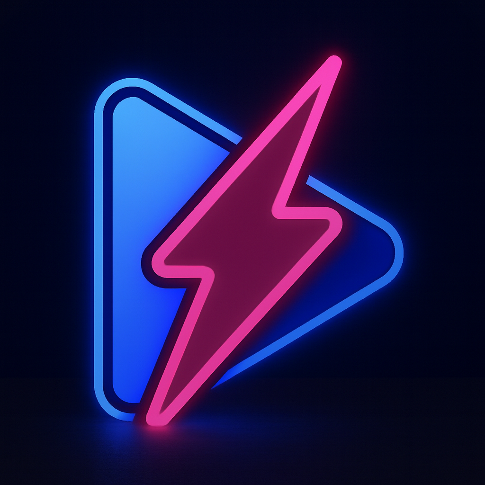
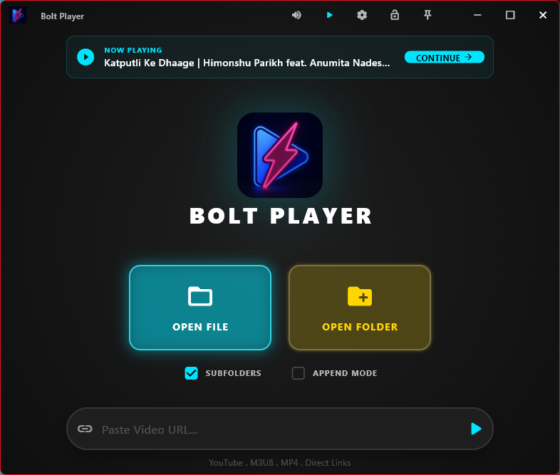

<h1 align="left">
  
  Bolt Player
</h1>

A desktop media player built with Flutter. It features a dark, high-contrast user interface and is optimized for performance and native system integration. It serves as a aesthetically stunning, highly functional alternative to standard media players.

 

## Get the Latest Release

Download the latest version from the **[Releases](https://github.com/Yuvi-GD/bolt_player/releases)** page.

* **Installer** ([BoltPlayer_Setup.exe](https://github.com/Yuvi-GD/bolt_player/releases/download/v1.0.0/BoltPlayer_Setup_1.0.0.exe)): Recommended. Registers file associations to enable "Open with" context menu support in Windows.
* **Portable** ([BoltPlayer-Windows.zip](https://github.com/Yuvi-GD/bolt_player/releases/download/v1.0.0/BoltPlayer-Windows.zip)): Extract and run without installation.

## Platform Support

Bolt Player is built from the ground up to be a universal media experience. Our stable 1.0.0 release is focused on Windows to establish a strong, feature-rich baseline, but the ecosystem is expanding.

* **Stable:** Windows
* **In Development:** Android, Linux, macOS, and iOS

## User Interface

The application features a dark theme with cyan accents and glassmorphic elements, designed to provide a clean and distraction-free viewing environment.

## Key Features

### Mouse Controls
Bolt Player is optimized for desktop mouse interaction, allowing control without relying on standard UI buttons:
* **Long-Press (Hold Left Click):** Triggers instant 2x playback speed.
* **Smart Scroll Zones:** 
  * **Left 25%:** Adjust brightness.
  * **Right 25%:** Adjust volume (supports software boost up to 200%).
  * **Center:** Seek playback (+/- 3 seconds).
* **Double-Click:** Toggle fullscreen.
* **Single-Click:** Play / Pause.

### Library and Playlist Management
* **Folder Grouping:** Automatically groups media by subfolders in the sidebar.
* **Root-First Logic:** Prioritizes main folder files over subfolders in the directory view.
* **YouTube Lazy Loading:** Processes YouTube Playlist links via batch metadata loading to conserve bandwidth.
* **Drag and Drop:** Supports direct playback of files, folders, or URLs dropped into the window.

### Windows Media Integration
* Full System Media Transport Controls (SMTC) integration via a custom C++/WinRT plugin.
* Displays song title, artist, and thumbnails in the Windows media overlay.
* Supports standard hardware media keys (play, pause, next, previous, stop).
* Native application name and icon mapping in the OS overlay.

### Additional Utilities
* **Title Bar Hover Card:** Hover over the Windows Title Bar play button for a live preview of the current track, thumbnail, and progress.
* **Screenshot Capture:** Take raw video frames with a single click. Screenshots open directly in the file explorer.
* **Locked Mode:** Press `L` to lock the UI, disabling all gestures and controls.
* **File Associations:** The installer natively registers over 33 video and audio formats.

## Keyboard Shortcuts

| Key | Action |
|-----|--------|
| `Space` | **Hold** for 2x Speed / **Tap** for Play/Pause |
| `F` / `F11` | Toggle Fullscreen |
| `L` | **Lock / Unlock** Player Controls |
| `M` | Mute / Unmute |
| `C` | Toggle Subtitles |
| `T` | Pin Player (Always on Top) |
| `Esc` | Back to Menu / Exit Fullscreen |
| `Arrows` | Volume (Up/Down) & Seek (Left/Right) |
| `Ctrl + Arrows` | **Next/Prev Track** (Left/Right) & **Brightness** (Up/Down) |

## Developer Guide

### Tech Stack
* **Framework:** [Flutter](https://flutter.dev)
* **Engine:** [media_kit](https://github.com/alexmercerind/media_kit) (libmpv based)
* **State Management:** [Riverpod](https://riverpod.dev)
* **Windowing:** [window_manager](https://github.com/leanflutter/window_manager)
* **YouTube Support:** `youtube_explode_dart`
* **SMTC:** Custom C++/WinRT plugin (no Rust dependency)
* **Installer:** [Inno Setup](https://jrsoftware.org/isinfo.php)

### Setup Instructions
1. **Prerequisites:** Flutter SDK + Visual Studio 2022 with C++ desktop workload.
2. **Clone the repository:** `git clone https://github.com/Yuvi-GD/bolt_player.git`
3. **Install dependencies:** `flutter pub get`
4. **Run the application:** `flutter run -d windows`
5. **Build release version:** `flutter build windows --release`
6. **Build installer:** Open `installer.iss` with Inno Setup and compile.

### Project Structure
* `lib/features/player/providers/`: Core logic, state management, and media services.
* `lib/features/player/presentation/screens/`: Main views including Home, Player, and Settings.
* `lib/features/player/presentation/widgets/`: HUD components, sidebars, and interactive overlays.

## Contribution

Pull requests are always welcome. Whether it is a small bug fix, a performance tweak, or help porting the app to new platforms, your contributions are appreciated. 

Here is the standard process to get your changes merged:

1. **Open an issue first:** For major features or architectural changes, please open an issue to discuss it before you start coding. This ensures we are on the same page and saves everyone time.
2. **Fork and branch:** Create a fork and do your work on a dedicated feature branch.
3. **Follow the style:** Keep your code consistent with the existing project structure and formatting.
4. **Submit a PR:** Keep your pull request focused on a single issue and explain exactly what your code does.

## License

This project is licensed under the GPL-3.0 License. See the [LICENSE](LICENSE) file for details.
